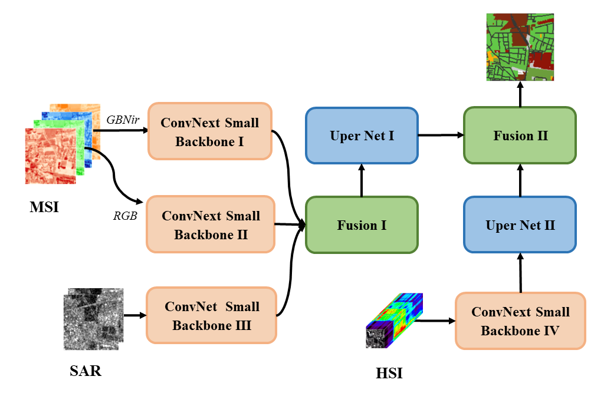

# Top3: Multimodal Remote Sensing Network

The codes of Multimodal Remote Sensing Network (MRSN).

* PaddleCD is adapted from [PaddleSeg](https://github.com/PaddlePaddle/PaddleSeg)
* For the train and prediction process, you can use [main.ipynb](main.ipynb) locally or start the project online in [source code](https://aistudio.baidu.com/projectdetail/6562334).